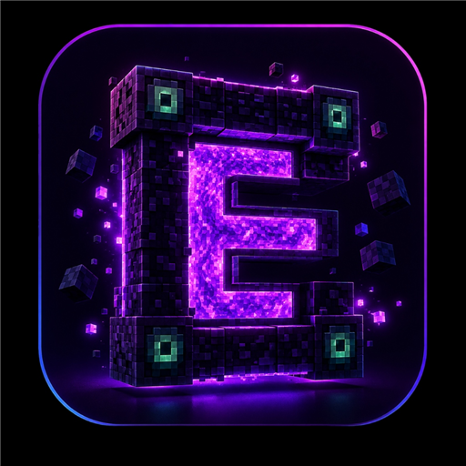
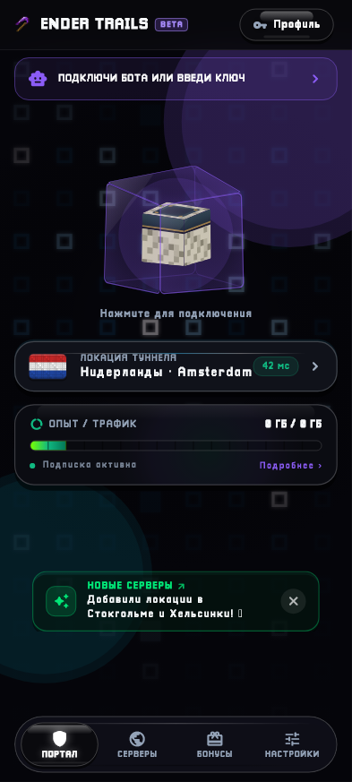
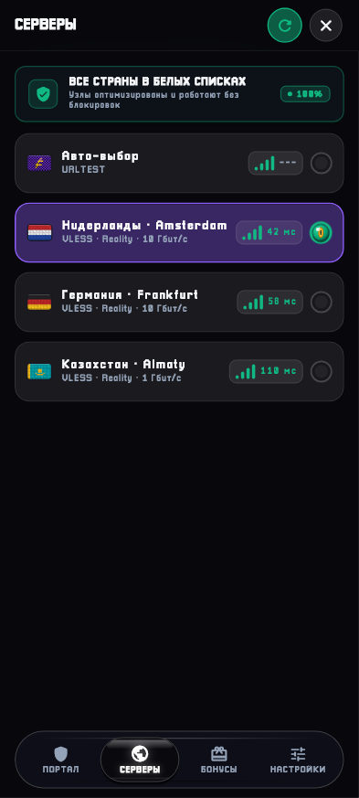
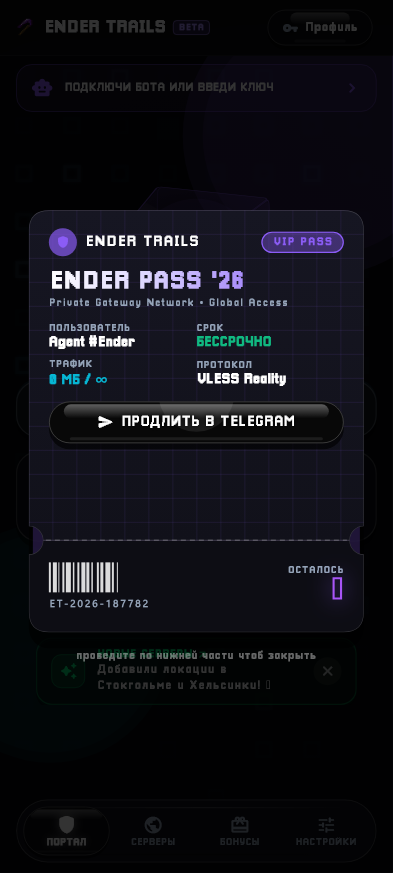
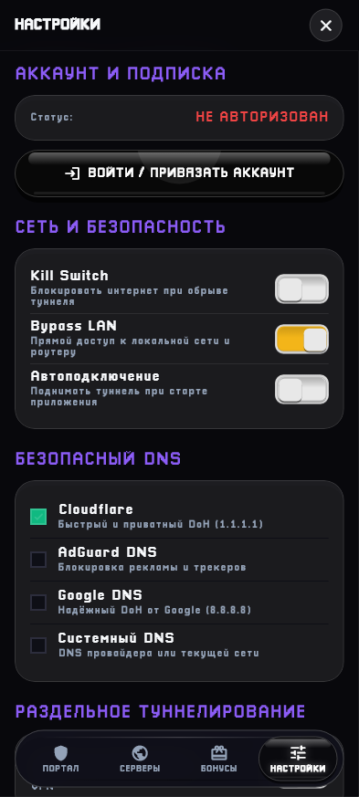

<div align="center">



# 🌌 ENDER TRAILS VPN

**Next-Gen Cyber-Fantasy VPN Client for Android**  
*Powered by Flutter 3.29 & Sing-box Core • VLESS Reality • Authentic Minecraft Pixel-Art Design*

[](https://github.com/forsakenqwx/ender-trails-mobile/releases)
[](https://flutter.dev)
[](https://github.com/SagerNet/sing-box)
[](https://android.com)

<br/>

[📥 Скачать APK (v1.0.0 Beta)](https://github.com/forsakenqwx/ender-trails-mobile/releases) • [🌐 Официальный сайт](https://endertrails.online) • [🤖 Telegram Бот](https://t.me/EnderTrailsVPN_bot)

</div>

---

## 📸 Галерея интерфейса

<div align="center">
  <table>
    <tr>
      <td align="center" width="25%">
        <b>⚡ Главный экран</b><br/><br/>
        
      </td>
      <td align="center" width="25%">
        <b>🛡 Белые списки узлов</b><br/><br/>
        
      </td>
      <td align="center" width="25%">
        <b>🎫 Ender Pass '26</b><br/><br/>
        
      </td>
      <td align="center" width="25%">
        <b>⚙ Настройки & DNS</b><br/><br/>
        
      </td>
    </tr>
  </table>
</div>

---

## ✨ Ключевые возможности

### 🌌 Уникальный дизайн и 120 FPS
- **Тактильная 3D-кнопка питания:** аутентичный блок с Оком Края, плавным неоновым кольцом и тактильным виброоткликом `HapticFeedback`.
- **Пиксельные флаги стран:** процедурная отрисовка 18×12 пикселей в Skia/GPU для всех стран мира с мягкой текстурой шерсти Minecraft.
- **Парящий билет Ender Pass '26:** киберпанк VIP-билет без лишних фонов с интерактивной физикой отрывания корешка свайпом для закрытия профиля.
- **Marcelodolza 3D-кнопки:** глубокий обсидиановый стиль (`#080808`), зеркальный стеклянный кант и пропорциональное масштабирование текста под экраны любых смартфонов.

### ⚡ Производительность и стабильность связи
- **Ядро Sing-box 1.14 (TUN):** прямая интеграция VLESS Reality, Trojan, VMess, Hysteria 2 и Shadowsocks без утечек IP.
- **Оптимизированный MTU (1400):** исключает сброс и фрагментацию пакетов на сотовых сетях (МТС, Билайн, Мегафон, Т2) и Wi-Fi при расширении TCP-окна.
- **Умная мобильная маршрутизация:** автоматический обход флаппинга сотовых вышек без принудительного `strict_route`, защищающий от разрывов при переключении 4G/5G.
- **Интеллектуальный DNS:** локальный прямой резолвинг для всей зоны `.ru`, `.su`, `.рф`, банков и Госуслуг в обход блокировок, с защитой зарубежного трафика через Cloudflare / Google / AdGuard DoH.

### 🛡 Все страны в белых списках
- Все пулы серверов настроены на протоколы нового поколения, полностью защищены от блокировок РКН и гарантируют 100% стабильную доступность.

### 🔄 Раздельное туннелирование (Split Tunneling)
- Выбор конкретных приложений для работы через VPN или напрямую.
- **Ультра-быстрый рендер иконок:** процедурная конвертация иконок установленных приложений в пиксель-арт 20×20 через Nearest-Neighbor (`FilterQuality.none`) с объёмной фаской блока Minecraft.

### 📢 Онлайн-управление анонсами
- Динамическая плашка важных событий прямо на главном экране с управлением через сервер или Telegram-бота `/setbanner`.
- Возможность закрытия плашки с сохранением в зашифрованном хранилище.

---

## 🛠 Технологический стек

- **Фреймворк:** [Flutter 3.29](https://flutter.dev) & [Dart 3.7](https://dart.dev)
- **Управление состоянием:** [Riverpod 3.0](https://riverpod.dev) (Code Generation & Notifiers)
- **Сетевое VPN-ядро:** `flutter_singbox_client` + `libbox.aar` (Go / gomobile)
- **Безопасное хранилище:** `flutter_secure_storage` (Android KeyStore / AES-256)
- **Навигация & Deep Links:** `go_router` + `app_links` (`endertrails://*`)
- **Графика и Шейдеры:** Процедурный Canvas, CustomPainter, Skia Textures

---

## 🚀 Сборка проекта

### Требования
- Flutter SDK `>=3.29.0`
- Android SDK (API 34, NDK 26+)
- Java JDK 17 / 21

### Шаги установки

1. **Клонируйте репозиторий:**
   ```bash
   git clone https://github.com/forsakenqwx/ender-trails-mobile.git
   cd ender-trails-mobile/app
   ```

2. **Установите зависимости:**
   ```bash
   flutter pub get
   ```

3. **Запустите генерацию кода (Freezed / JSON):**
   ```bash
   dart run build_runner build --delete-conflicting-outputs
   ```

4. **Запуск тестов:**
   ```bash
   flutter test
   ```

5. **Сборка релизного APK:**
   ```bash
   flutter build apk --release
   ```
   Готовый файл будет находиться по пути: `build/app/outputs/flutter-apk/app-release.apk`.

---

## 📄 Лицензия

Проект распространяется для пользователей сервиса **Ender Trails**.  
Все права защищены © 2026 Ender Trails Team.
